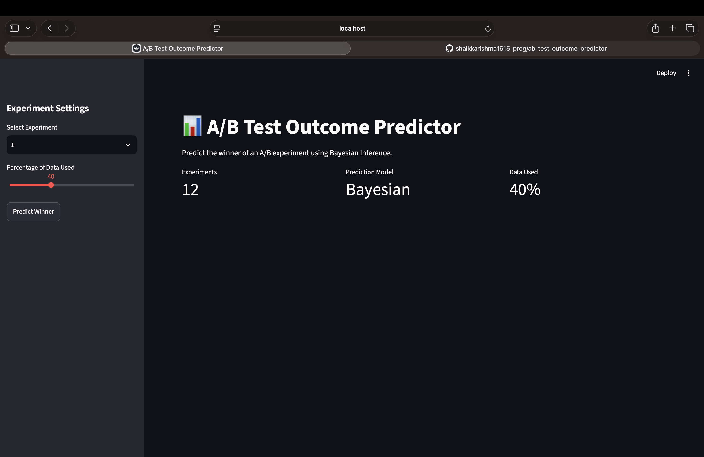
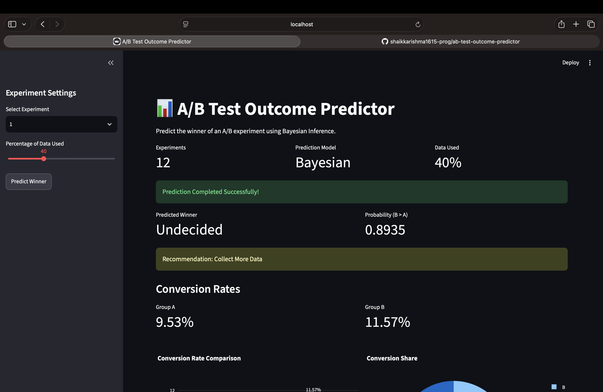
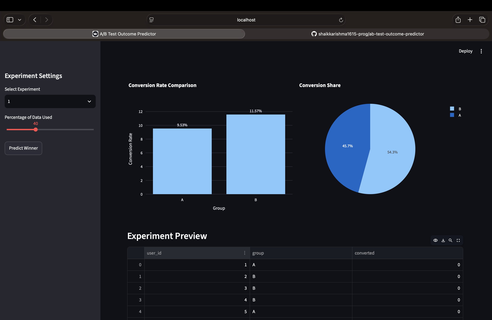
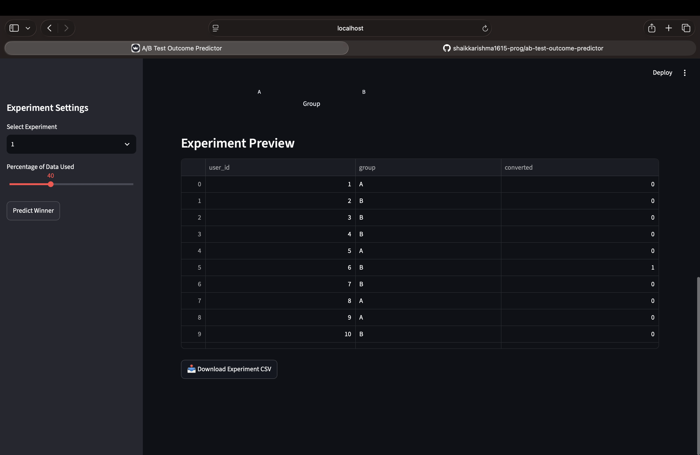

# 📊 A/B Test Outcome Predictor

An ML-powered system that predicts the outcome of A/B tests before they reach full statistical significance using Bayesian Inference. This project demonstrates how experimentation platforms can make early decisions while maintaining confidence in the predicted winner.

---

## Features

- Simulates multiple A/B experiments
- Bayesian A/B testing using PyMC
- Early winner prediction using partial experiment data
- Statistical confidence estimation
- Experiment evaluation across multiple datasets
- Interactive Streamlit dashboard
- Conversion rate visualization
- CSV report generation

---


## ▶️ Running the Project

Generate datasets:

```bash
python3 src/simulator.py
```

Run Bayesian analysis:

```bash
python3 src/bayesian_model.py
```

Predict early experiment outcome:

```bash
python3 src/predictor.py
```

Evaluate multiple experiments:

```bash
python3 src/evaluator.py
```

Launch the dashboard:

```bash
streamlit run src/dashboard.py
```

---


## 📈 Dashboard

The dashboard allows you to:

- Select an experiment
- Choose how much data has been collected
- Predict the experiment winner
- View Bayesian probability
- Compare conversion rates
- Download experiment data

---
## Screenshots

### Dashboard Home



---

### Prediction Result



---

### Charts



---

### Dataset Preview



---


## Author

**Shaik Karishma**

Machine Learning | Data Science | Python

---